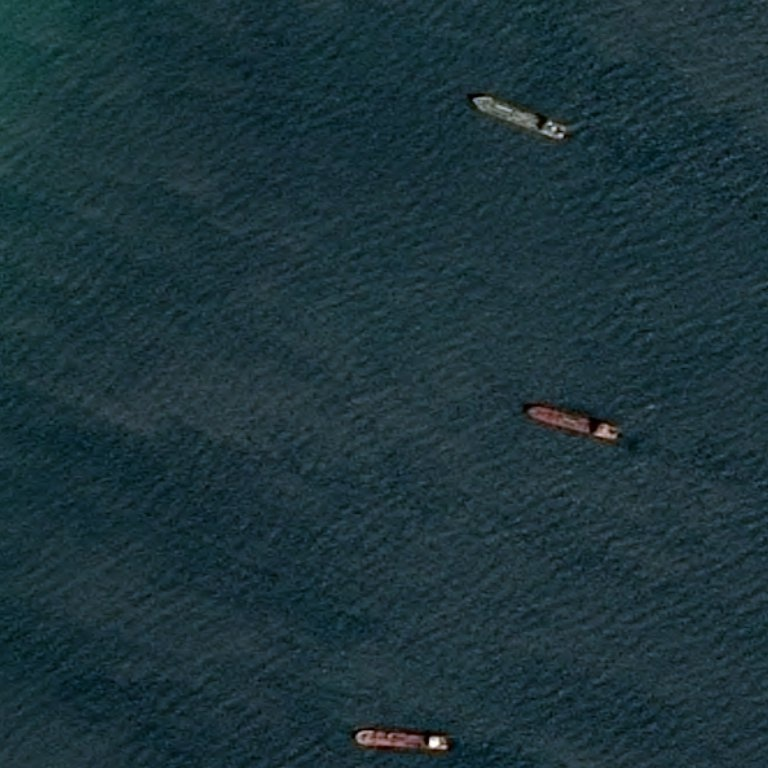
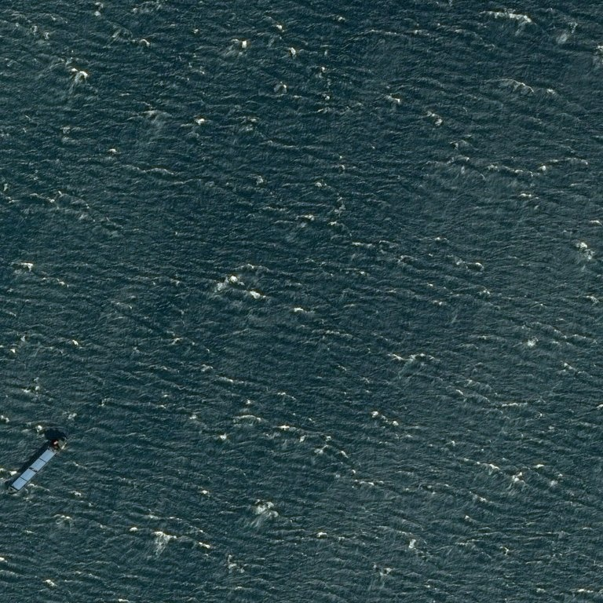
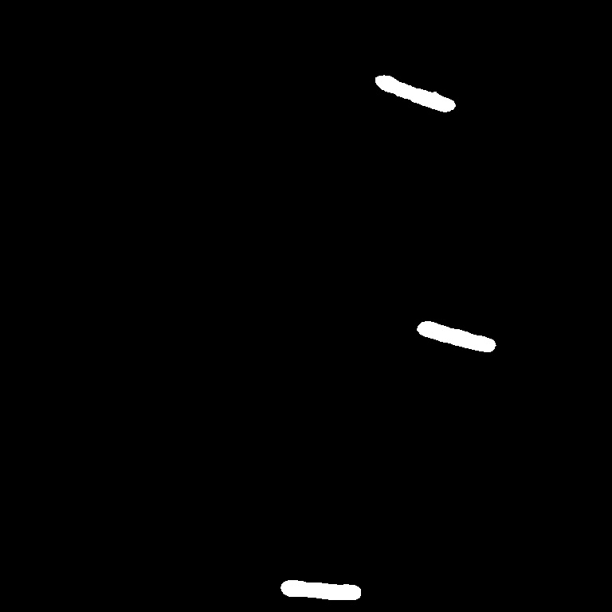
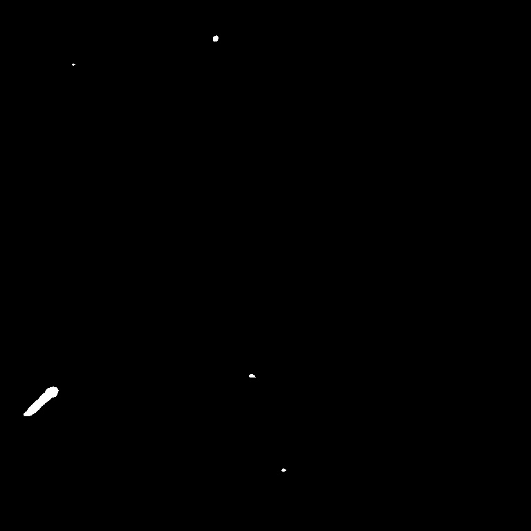

# Airbus Ship Detection Challenge

  

## Introduction
The [Airbus Ship Detection Challenge](https://www.kaggle.com/competitions/airbus-ship-detection/overview) aims to advance ship detection in satellite imagery. Participants develop algorithms to automatically identify and locate ships, contributing to maritime applications. This repository contains my approach and solution, implementing various techniques for accurate ship detection.

## Installation and Usage

### Project structure

## Dataset

The dataset comprises approximately 192,000 RGB satellite images of size 768x768, depicting various scenes such as ships, sea, and urban environments. It is important to note that the dataset initially contained data leakage, resulting in potential information duplication up to nine times. To address this issue, advanced cleaning techniques were applied to ensure the accuracy and integrity of the dataset.

After the removal of duplicate entries, the dataset was reduced to approximately 10,000 images that specifically depict ships. Notably, the presence of ships in the images is relatively sparse, with ship-related information occupying only around 0.09% of each image. To expedite training, a model was designed and trained on cropped images of size 256x256.

It is worth mentioning that the dataset exhibits an imbalance in ship presence, as approximately 85% of the images do not contain any ships. To enhance the accuracy of ship detection, the proposed solution involves a two-step process: first, classifying whether a ship is present in the image, and if so, performing segmentation.

Furthermore, it should be noted that the dataset may contain additional challenges such as image corruption, presence of clouds, or urban areas, which affect the model's performance.

The provided Airbus dataset class offers the capability to generate both classification and segmentation training and validation datasets. The segmentation dataset exclusively consists of images that contain ships, whereas the classification dataset includes a balanced distribution of 30% non-ship images as well. Data leakage is removed.

### Preprocessing

During the training process, I utilized both soft image augmentation techniques, such as flipping and rotating with border reflection, as well as hard image augmentation techniques, which additionally included ColorJitter, RandomGamma, three types of blur, and ElasticTransform.

Prior to inputting each image into the model, it was normalized by scaling it with a factor of 255. For segmentation training, a "smart crop" technique was applied to the samples.

> The "smart crop" involves a custom transformation method to crop high-resolution images to the desired size while ensuring the target object is included. The process begins by centering the object within the crop kernel, and then a random shift is applied to move the object away from the direct center. If there are multiple objects within the high-resolution image, the "smart crop" function returns the crop that contains the most relevant information or performs a random crop if necessary.

  
  

## Solution

To address the problem in the most efficient manner, I propose a two-stage model. Given the dataset's class imbalance and the high rate of False Positive errors produced by the Unet model, the first stage aims to classify whether any ships are present in the image. If the classification result is positive, the second stage, which involves segmentation, is activated.

For the classification stage, I have developed a custom ResNet model. The architecture of this model can be flexible, allowing for varying depths based on the number of filter channels specified in the builder. In my case, I used an adaptation of ResNet18, incorporating optimization techniques to enhance model runtime and reduce parameter count. I drew inspiration from the paper ["Bag of Tricks for Image Classification with Convolutional Neural Networks"](https://arxiv.org/pdf/1812.01187.pdf) and received valuable insights from the original ResNet paper ["Deep Residual Learning for Image Recognition"](https://arxiv.org/pdf/1512.03385.pdf). With GlobalMaxPooling in the final layer, the model can handle images of different sizes for prediction.

As for the segmentation stage, I initially constructed a conventional Unet model but encountered challenges with overfitting and slow improvement. To address this, I introduced a custom ResNet backbone to the Unet architecture, which significantly improved performance and mitigated overfitting to some extent. The depth of the encoder in this stage is also adjustable based on the size of the input filter channels, allowing for easy modifications. To combat overfitting, I implemented a technique described in the original U-Net paper ["U-Net: Convolutional Networks for Biomedical Image Segmentation"](https://arxiv.org/pdf/1505.04597.pdf) and added Dropout layers to some last convolution blocks in the encoder section, yielding significant improvements.

### Training

- A custom loss function is employed, combining Binary Cross Entropy (BCE) and Dice loss with weights of 0.75 and 0.25, respectively. This combination yields superior results compared to using only BCE.
- The model architecture is designed to handle images of varying sizes, but during training, images are resized to 256x256 pixels, significantly accelerating the training process. Validation, however, is performed on the original full-size images.
- The model is configured to utilize 16-bit precision, resulting in faster training and reduced model size.
- The Adam optimizer is utilized for model optimization.
- The training process consists of 10 epochs with strong data augmentation and a learning rate of 2e-3, followed by 5 epochs with a reduced learning rate of 4e-4. Subsequently, soft data augmentation is applied for 5 epochs with a learning rate of 2e-3, followed by another 5 epochs with a learning rate of 4e-4.
- The addition of Dropout layers in the model's architecture leads to an increase of 0.1 in the validation Dice coefficient, indicating improved performance in mitigating overfitting.
- Fine-tuning the threshold value to 0.95 after applying the sigmoid activation in the final layer results in a slight increase of 0.01 in the Dice coefficient.

### Perfomance

The final model achieved the following performance metrics:
| Metric | Validation Score |	Training Score |
|--------|------------------|----------------|
|  Dice  |	    0.6825      |	     0.8364    |
|F2 Score|	    0.6634      |	     0.8271    |

Here presented examples of the model's performance on sample images from the Dataset section:

  
  

 

> Note: The training was performed on a Kaggle P100 GPU.

## Improvements points
During the training phase, I encountered various challenges and identified areas for improvement in the future:

- In order to achieve a reliable solution quickly, I initially proposed the use of two separate models, a classifier and a segmentator. However, a more efficient approach emerged, suggesting the utilization of the pretrained U-Net encoder with additional layers on top for classification, rather than training a new classifier from scratch. A more advanced approach is to perform classification directly within the U-Net bottleneck, eliminating the need for additional processing time in a separate classifier.

- EDA, I observed that the dataset may consist of images from different sources (satellites) with varying characteristics. It might be beneficial to group these images based on their source and train separate models for each type, or at least apply different preprocessing techniques based on the image source.

- Due to limited computational resources, I did not extensively experiment with different architecture designs. Exploring U-Net models with fewer layers could potentially mitigate overfitting issues, while deeper U-Net architectures might better capture the distinctions between ships and coastlines.
 
- To address overfitting, incorporating alternative convolution types such as depth-wise convolution, depth-wise separable convolution, or dilated convolution could be advantageous. These convolution types offer reduced model parameters compared to standard convolutions and may contribute to better generalization.
 
- Employing an ensemble of U-Net models can enhance performance by combining the predictions from multiple models, providing a more robust and accurate segmentation outcome.

- TTA (Test Time Augmentation) can improve the reliability and performance of the segmentation model by averaging or voting the predictions from different augmented images.

- Refine the final predicted mask to have a more rectangular shape for the object.
